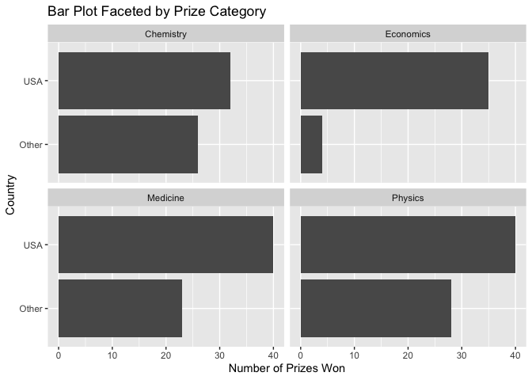

Lab 03 - Nobel laureates
================
Cailey Fay
10.7.25

### Load packages and data

``` r
library(tidyverse) 
```

``` r
nobel <- read_csv("data/nobel.csv")
```

## Exercises

### Exercise 1

``` r
nrow(nobel)
```

    ## [1] 935

``` r
ncol(nobel)
```

    ## [1] 26

``` r
#There are 26 variables and 935 observations. 
```

Remove this text, and add your answer for Exercise 1 here. Add code
chunks as needed. Don’t forget to label your code chunk. Do not use
spaces in code chunk labels.

### Exercise 2

``` r
nobel_living <-nobel %>%
      filter(is.na(died_date),gender != "org", !is.na(country))

nobel_living %>%
  select(died_date, gender, country)
```

    ## # A tibble: 228 × 3
    ##    died_date gender country       
    ##    <date>    <chr>  <chr>         
    ##  1 NA        male   USA           
    ##  2 NA        male   USA           
    ##  3 NA        male   USA           
    ##  4 NA        male   USA           
    ##  5 NA        male   USA           
    ##  6 NA        male   United Kingdom
    ##  7 NA        male   United Kingdom
    ##  8 NA        male   Denmark       
    ##  9 NA        male   USA           
    ## 10 NA        male   USA           
    ## # ℹ 218 more rows

``` r
nobel_living_frame <-as.data.frame(nobel_living %>%
  select(died_date, gender, country))

nrow(nobel_living_frame)
```

    ## [1] 228

### Exercise 3

``` r
nobel_living <- nobel_living %>%
  mutate(
    country_us = if_else(country == "USA", "USA", "Other")
  )

nobel_living_science <- nobel_living %>%
  filter(category %in% c("Physics", "Medicine", "Chemistry", "Economics"))
#nobel_living_science has everything in terms of US or not at the time of winning the prize, and narrows down the disciplines to physics, medicine, chemistry, and econ 

#faceted bar plot 
ggplot(nobel_living_science, aes(x = country_us)) +
  geom_bar() +
  coord_flip() +
  facet_wrap(~ category) +
  labs(title = "Bar Plot Faceted by Prize Category", 
       x = "Country", 
       y = "Number of Prizes Won")
```

<!-- -->

### Exercise 4: 105 from the US, and 123 from other countries

``` r
nobel_living <-nobel_living %>%
  mutate(
   born_country_us = if_else(born_country == "USA", "USA", "Other")
  )

table(nobel_living$born_country_us)
```

    ## 
    ## Other   USA 
    ##   123   105

…

### Exercise 5

…

### Exercise 6

…
